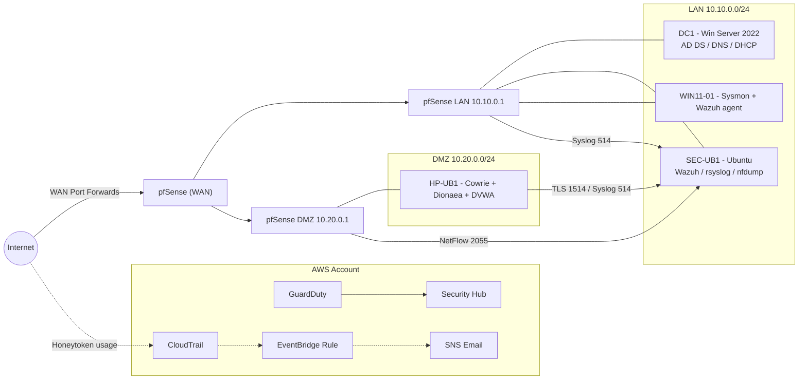

# Net-Sec-HoneyPot

Build and safely operate a segmented **honeynet** that mirrors a city-government SOC.
This repo showcases network segmentation, detections mapped to **MITRE ATT&CK**, ready-to-run
IR playbooks, and governance artifacts aligned to **NIST CSF / 800-53**.

## Snapshot

- **Network isolation** — pfSense routes WAN/LAN/DMZ, enforces DMZ egress deny, and feeds syslog/NetFlow to the SIEM.
- **Telemetry stack** — Windows Server 2022 + Windows 11 with Sysmon, Ubuntu SEC-UB1 running Wazuh, rsyslog, and nfdump.
- **Honeypots** — Cowrie (SSH/Telnet), Dionaea (multi-service), optional DVWA for web exploitation demos.
- **Cloud signals** — AWS CloudTrail, GuardDuty, Security Hub, and honeytoken IAM keys with EventBridge → SNS alerting.
- **Portfolio-ready collateral** — Runbooks, detections, control matrix, and evidence checklist for interviews or tabletop exercises.

## Architecture

## Quick Links

- Architecture notes → `docs/architecture/topology.md`
- Dataflow & safety model → `docs/architecture/dataflow.md`, `docs/architecture/safety.md`
- Runbooks → `docs/runbooks/`
- Detections (Wazuh/Splunk/Sentinel) → `detections/`
- Roadmap & milestones → `docs/roadmap.md`
- Governance & ethics → `docs/governance/`, `SECURITY.md`
- Evidence capture guide → `docs/evidence/README.md`

## Deliverables & Outcomes

| Track | Outcome |
|-------|---------|
| **Infrastructure** | VMware networks, pfSense segmentation, optional Suricata add-on, snapshots & rollback guidance. |
| **Telemetry & SIEM** | Wazuh deployment scripts, rsyslog collector, NetFlow via nfdump, Sysmon/Wazuh agent installers. |
| **Honeypots** | Cowrie + Dionaea automated install, DVWA container option, DMZ hardening checklist. |
| **Cloud** | AWS security services bootstrap, honeytoken IAM user, EventBridge → SNS notifications. |
| **Operations** | IR runbooks, detections mapped to ATT&CK, control matrix linking controls to evidence. |
| **Portfolio Assets** | Presentation stubs (`presentations/`), evidence packaging script, interview-ready screenshots checklist. |

## Getting Started

1. **Clone & install dependencies** (no runtime packages required beyond bash/PowerShell).
2. **Follow the roadmap** — start with `docs/roadmap.md` Milestone 0/1 for scaffolding and base infrastructure.
3. **Capture evidence as you go** — use `docs/evidence/README.md` and `scripts/make-evidence-pack.ps1` to build a clean portfolio pack.
4. **Keep secrets out of git** — `.gitignore` covers common artifacts; run detections/alert tests using synthetic data or sanitize with `scripts/utilities/sanitize-logs.py`.

## Safety & Ethics

Honeypots remain isolated in a DMZ with strict egress controls. Never weaponize captured samples outside this lab. Review and abide by `SECURITY.md` before operating the environment.

## License

Released under the MIT License — see `LICENSE`.
